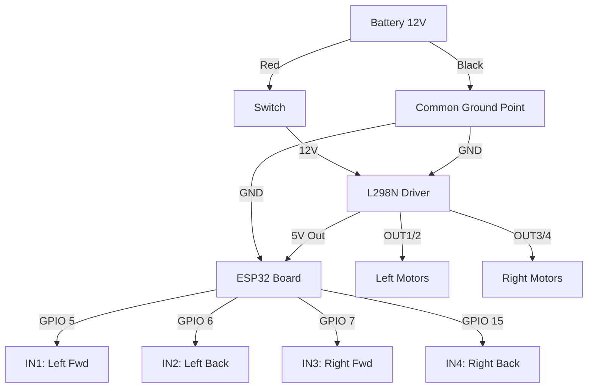

# 🔌 Sheldon Rover: Wiring Guide

## 1. Quick System Overview
Here is how the wires connect.



---

## 2. Breadboard Map (Top View)
Use this map to see where wires go on the breadboard.

```ascii
      [ BATTERY PACK ]
         |      |
       (Red)  (Black)
         |      |
      [SWITCH]  |
         |      |
         |      v
         v    (Common GND Row on Breadboard)
       (12V)    ============================
         |          |           |
         |          |           |
    +----v----------v-----------v----+
    | [12V]       [GND]        [GND] |   <-- ESP32 GND Pin
    |                                |
    |   L298N MOTOR DRIVER           |
    |                                |
    | [IN1] [IN2] [IN3] [IN4]        |
    +---^-----^-----^-----^----------+
        |     |     |     |
        |     |     |     |  (Signal Wires)
        |     |     |     |
    +---5-----6-----7-----15---------+
    | GPIO Pins on ESP32 Side        |
    |                                |
    |          [ ESP32 ]             |
    +--------------------------------+
```

---

## 3. Wiring Checklist (Step-by-Step)
Connect these wires one by one.

| Check | From Component | Pin Name | To Component | Pin Name | Wire Color |
| :--- | :--- | :--- | :--- | :--- | :--- |
| [ ] | **L298N** | `IN1` | **ESP32** | `GPIO 5` | Any |
| [ ] | **L298N** | `IN2` | **ESP32** | `GPIO 6` | Any |
| [ ] | **L298N** | `IN3` | **ESP32** | `GPIO 7` | Any |
| [ ] | **L298N** | `IN4` | **ESP32** | `GPIO 15` | Any |
| [ ] | ** Battery ** | `Red (+)` | **Switch** | `Input` | Red |
| [ ] | **Switch** | `Output` | **L298N** | `12V` | Red |
| [ ] | **Battery** | `Black (-)` | **L298N** | `GND` | Black |
| [ ] | **L298N** | `GND` | **ESP32** | `GND` | Black |

---

## 4. Troubleshooting
*   **Motors Twitching?** -> You forgot the **Common Ground** (Battery (-) to ESP32 GND). Connect it immediately!
*   **Nothing lights up?** -> Check if the **Switch** is ON.
*   **One side goes backwards?** -> Swap the two wires going to that *motor* (e.g., swap wires at OUT1).
